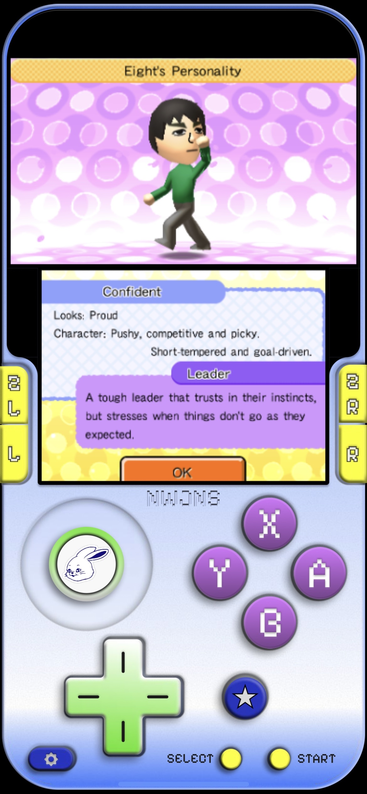
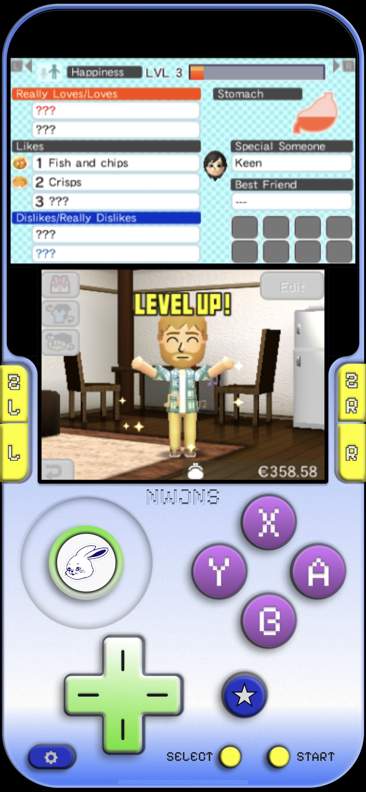

# newjeans 3ds manic skin

This is a custom newjeans-themed skin for the manic emulator. it features a standard 3ds layout with full touch support.

**changelog:** v1.3 landscape mode support and buttons ui improved

## how to use the skin
1. Download the `nwjns-3ds.manicskin` file to your phone.
2. Open the manic emulator app.
3. Go to the skin settings and tap the plus icon to add a new skin.
4. Select the downloaded `.manicskin` file.
5. Choose the skin from your list to apply it.

## snapshots
 

## contributors

| avatar | name | role | contributions |
| :---: | :--- | :--- | :--- |
|  | **[Kate Aikeen Fabiani](https://github.com/aikeen8)** | UI/UX Designer | responsible for designing the look and feel of the emulator skin using figma. created the visual layout, custom background, and button designs. |
|  | **[Alexander Knight](https://github.com/alexxknightt)** | Developer | responsible for making the skin functional. mapped the x and y screen coordinates for all touch hitboxes, wrote the json configuration file, and packaged the final build. |
