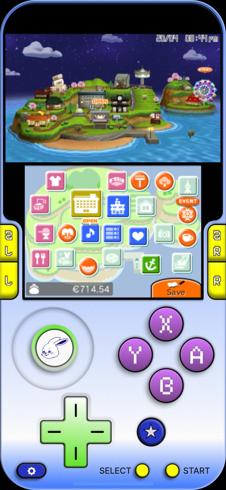
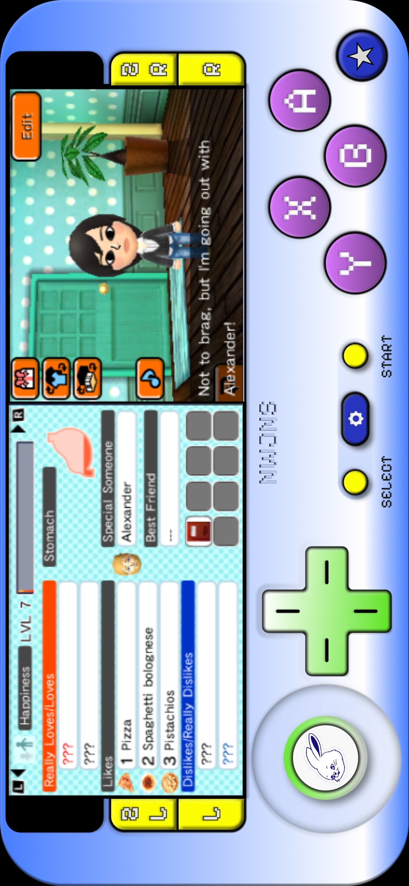
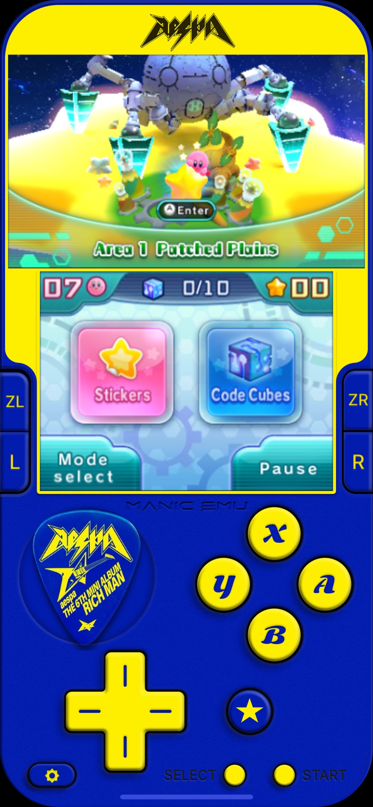
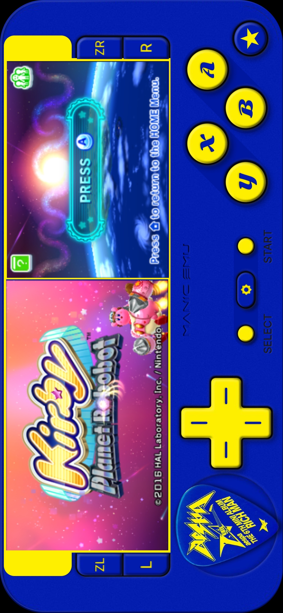

# collection of custom 3DS manic skins

This is a custom skins for the manic emulator I designed and built. Every skin features a standard 3ds layout with full touch support.

**changelog:** v1.3 landscape mode support and buttons ui improved for newjeans 3DS skin

## how to use the skin
1. Download the `.manicskin` file to your phone.
2. Open the manic emulator app.
3. Go to the skin settings and tap the plus icon to add a new skin.
4. Select the downloaded `.manicskin` file.
5. Choose the skin from your list to apply it.

## snapshots

 

<i>Newjeans 3DS</i>

 

<i>Aespa Richman 3DS</i>

## contributors

| name | avatar | role | contributions |
| :---: | :--- | :--- | :--- |
| **[Kate Aikeen Fabiani](https://github.com/aikeen8)** |  | Lead Designer & Developer | Designs the visual layouts and custom assets for the skins. Also implements the functional configuration, including mapping touch coordinates and writing JSON files, for select skins. |
|  **[Alexander Knight](https://github.com/alexxknightt)** |  | Developer | Implements the functional configuration for select skins. Maps touch coordinates, writes the JSON configuration files, and packages the final builds. |